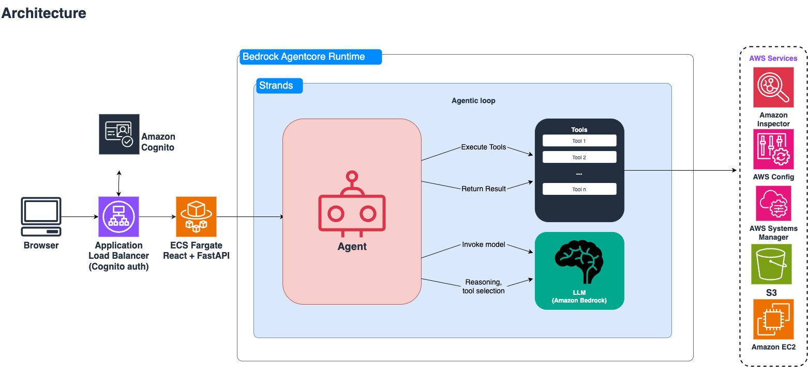

# Architecture — Intelligent Patch Automation



---

## System components

| Component | Service / Framework | Role |
|---|---|---|
| Application Load Balancer | AWS ALB | The front door. Authenticates users through Amazon Cognito (OIDC) and routes traffic to Fargate. |
| Web UI | ECS Fargate (React + FastAPI) | Serves the dashboard and chat panel. Streams agent responses to the browser over SSE. |
| AgentCore Runtime | Amazon Bedrock AgentCore | Runs the Strands agent app. Handles runtime hosting, session memory (STM), and OpenTelemetry log/trace export. |
| AgentCore Memory | Amazon Bedrock AgentCore | Persists conversation turns per session, scoped per operator via `actor_id`. |
| Strands Framework | [Strands Agents SDK](https://github.com/strands-agents/sdk-python) | Drives the agentic loop (LLM ↔ tool execution) and the steering handlers that enforce workflow safety. |
| LLM | Amazon Bedrock (Claude Sonnet 5, with adaptive thinking) | Reasoning, planning, and tool selection. Called via `BedrockModel` in `agent/helper/agent_factory.py`. |
| AWS services | Inspector, Systems Manager, S3, EC2, CloudWatch, Organizations | Where the tools do their work via boto3: Inspector for CVEs, SSM for patching and automation, S3 for reports, EC2 for instance metadata. |

---

## Agent design

One agent handles the whole workflow — vulnerability analysis, patching, rollback, and compliance reporting. On every turn it chooses directly from all 24 tools.

| Property | Value |
|---|---|
| Entrypoint | `agent/supervisor.py` (`agent_invocation`) |
| Created by | `create_agent(name="patch-automation-unified", ...)` in `agent/helper/agent_factory.py` |
| Tools | 24, spanning vulnerability, patch, fleet, maintenance, and compliance domains |
| Model | Claude Sonnet 5 (`us.anthropic.claude-sonnet-5`), adaptive thinking enabled |
| Max tokens | 16000 |
| Memory | Read + Write (STM) via `AgentCoreMemorySessionManager` |
| Steering | `PatchWorkflowSteering`, `ComplianceOutputSteering`, `ConfirmationGoalHandler` |

The model ID is configurable through the `BEDROCK_MODEL_ID` environment variable. Sonnet 5+ models run with `thinking: adaptive`, which lets the model reason before it picks a tool and tends to produce better plans. Other models fall back to a fixed low temperature.

There's no prompt-level routing layer. Tool selection stays correct because of structural cues — `next_action` hints, `Decision:` docstrings, and steering handlers. See [Tools and routing](#tools-and-routing).

---

## Tools and routing

### Tools

Tools are Python functions decorated with `@tool` (from the Strands SDK) that the LLM can call during the agentic loop. Each one wraps one or more boto3 API calls and hands back a structured dict the LLM uses to decide what comes next.

There are 24 tools in total, organised into domain modules under `agent/helper/tools/`:

| Module | Tools | Domain |
|--------|-------|--------|
| `fleet_tools.py` | `get_fleet_overview`, `resolve_execution_scope` | Fleet discovery, cross-account scope planning |
| `patch_tools.py` | `get_patch_compliance`, `patch_dry_run`, `execute_patch_operation`, `multi_account_dry_run`, `multi_account_execute`, `get_command_status`, `get_automation_status`, `emergency_stop`, `rollback_patches`, `verify_rollback`, `multi_account_rollback` | Patch lifecycle (scan, execute, rollback, monitor) |
| `maintenance_tools.py` | `get_maintenance_windows`, `get_patch_policy`, `create_maintenance_window`, `check_instance_health`, `check_cloudwatch_alarms`, `verify_and_proceed` | Scheduling, health checks, maintenance windows |
| `vulnerability_tools.py` | `get_vulnerability_findings`, `assess_fleet_impact` | CVE analysis via Amazon Inspector |
| `compliance_tools.py` | `query_compliance_reports`, `capture_patch_state`, `verify_cve_remediation` | S3 compliance reports, before/after snapshots |

All 24 are on the table every turn. Instead of restricting tools by role, the solution nudges the model toward the right pick with `next_action` hints and `Decision:` docstrings (below), backed by the `PatchWorkflowSteering` handler, which blocks the wrong choices outright.

The agent also gets `get_response_template` — a tool that loads structured response templates by name (they live in `agent/config/response_templates.yaml`). That keeps formatting guidance out of the system prompt and lets the agent grab the right template only when it needs it.

### `next_action` hints

The important tools return a `next_action` field in their result dict that spells out what to do next. The LLM sees the whole dict as a tool result, and `next_action` removes the guesswork — no ambiguity, and no prompt-level rule to remember.

Here's `resolve_execution_scope` (`agent/helper/tools/fleet_tools.py`):

```python
return {
    'environment': env_value,
    'accounts': accounts,              # list of {account_id, region, instance_count, ...}
    'total_accounts': len(accounts),
    'total_instances': total_instances,
    'total_unmanaged': total_unmanaged,
    'total_missing': total_missing,
    'regions': scope['regions'],
    'multi_account': scope['multi_account'],
    'execution_defaults': EXECUTION_DEFAULTS,
    'confirmation_required': scope['multi_account'],
    'next_action': "Present the account plan to the operator. Then call "
                   "multi_account_dry_run or multi_account_execute with these account_ids.",
}
```

### `Decision:` docstrings

Nine tools carry a `Decision:` line in their docstring that shows up in the tool schema. It helps the LLM pick the right tool without a prompt-level routing rule:

```python
def execute_patch_operation(...):
    """Execute patching via SSM Automation (MAMR).

    Decision: Use when operator names specific instance IDs (i-xxx).
    For fleet-scope patching by environment/severity/CVE, use multi_account_execute instead.
    """
```

---

## Patch execution flow

The agent has two execution paths, and which one it uses depends on how the operator describes the target. The `PatchWorkflowSteering` handler enforces the choice — the model can't mix the two.

### Execution paths

| Path | When used | SSM Automation document | Targeting |
|------|-----------|------------------------|-----------|
| Path A — instance-ID | Operator names specific instance IDs (e.g., `Patch i-0abc123 and i-0def456`) | `Patchy-RunPatchBaselineById` (patch) / `Patchy-RunRollbackById` (rollback) | `InstanceId` parameter — hits exactly the named instances |
| Path B — tag-based | Operator describes a fleet scope by environment, severity, or CVE (e.g., `Patch all critical in prod`) | `Patchy-RunPatchBaseline` (patch) / `Patchy-RunRollback` (rollback) | Tag filters: `tag:Environment` + `tag:PatchAutomation=enabled` — hits every matching instance |

Both paths run SSM Automation with `TargetLocations` for cross-account fan-out. The Automation service assumes `PatchySpokeRole` in each target (account, region) and runs the document locally. The four documents are deployed by the `Patchy-SsmDocs` StackSet into every (account, region) the agent fans out into.

### Execution sequence

Here's the end-to-end when an operator says: "Handle CVE-2025-38477 in dev"

| Step | What the agent does | Tool called | What happens in AWS |
|------|-------------------|-------------|-------------------|
| 1 | Looks up the CVE across all accounts/regions | `get_vulnerability_findings` | `inspector2:ListFindings` fan-out via `PatchySpokeRole` per target |
| 2 | Maps which instances are affected | `assess_fleet_impact` | Correlates Inspector findings to EC2 instance IDs |
| 3 | Checks maintenance windows in dev | `get_maintenance_windows` | `ssm:DescribeMaintenanceWindows` fan-out across targets |
| 4 | Checks for existing patch policies on those instances | `get_patch_policy` | `ssm:ListAssociations` + `ssm:DescribeAssociation` fan-out |
| 5 | Reads the SLA tag (`SLA-HIGH=72`) and compares to the next window (6 hours out). 6h < 72h, so SCHEDULED is possible — but no Install policy covers the instances, so it decides EMERGENCY | Internal logic | — |
| 6 | Resolves execution scope (which accounts, regions, instance count) | `resolve_execution_scope` | `ssm:GetOpsSummary` for fleet data |
| 7 | Runs a dry-run scan to show what patches will be installed | `multi_account_dry_run` | `ssm:StartAutomationExecution` with `Patchy-RunPatchBaseline` + `Operation: Scan` via `TargetLocations` |
| 8 | Presents the plan: "5 instances, 12 patches including your CVE. Approve?" | — (text response) | — |
| 9 | Operator says "yes" | — | — |
| 10 | `ConfirmationGoalHandler` fires, so the agent retries with `confirm_execute=True` | `multi_account_execute` | `ssm:StartAutomationExecution` with `Patchy-RunPatchBaseline` + `Operation: Install` via `TargetLocations` |
| 11 | Polls for completion | `get_automation_status` | `ssm:DescribeAutomationExecutions` |
| 12 | Verifies instance health after the patch | `check_instance_health`, `check_cloudwatch_alarms` | `ssm:DescribeInstanceInformation`, `cloudwatch:DescribeAlarms` |
| 13 | Reports success. The compliance report is written asynchronously by the UI backend on the next dashboard load. | — (text response) | `s3:PutObject` (compliance report JSON) |

This runs as Path B (tag-based) because the operator said "in dev" without naming specific instance IDs. Had they said "Patch i-0abc123", the agent would take Path A (instance-ID) with `Patchy-RunPatchBaselineById` instead.

### SLA decision matrix

| Condition | Decision |
|-----------|----------|
| Next window within SLA and an Install policy already covers the instances | DEFER — the existing policy handles it |
| Next window within SLA but no Install policy | SCHEDULED — register a task with the maintenance window |
| Next window exceeds SLA (or no window exists) | EMERGENCY — patch immediately |

SLA thresholds come from EC2 instance tags (`SLA-CRITICAL`, `SLA-HIGH`, and so on). Defaults are 24/72/168/720 hours, defined in `agent/helper/tools/_shared.py` (`_DEFAULT_SLA`).

---

## Safety mechanisms

### Steering handlers — what they are and how they work

Steering handlers are deterministic Python classes (from `strands.vended_plugins.steering.SteeringHandler`) that hook into the agentic loop at two points — before a tool call runs, and after the model returns a response. They inspect what the model is about to do, check it against the domain rules, and then either:

- `Proceed()` — let the tool call run as-is.
- `Guide(instructions)` — inject corrective instructions back to the model without an extra LLM round-trip. The model gets the Guide as context and self-corrects on the same turn.

This is not the same as putting rules in the system prompt. Prompt rules depend on the model remembering them across a long conversation. Steering handlers fire from code, deterministically — they can't be forgotten, talked out of via prompt manipulation, or dropped when the context window fills up. This is the code-enforced safety layer.

The agent wires three handlers through the `plugins` list in `agent/helper/agent_factory.py`:

```python
plugins = [PatchWorkflowSteering(), ComplianceOutputSteering()]
plugins.append(ConfirmationGoalHandler())
```

`PatchWorkflowSteering` and `ComplianceOutputSteering` run before tool calls to enforce workflow ordering and guard compliance output. `ConfirmationGoalHandler` (from `agent/helper/goals.py`) runs after model responses — not tool calls — to catch the case where the model forgets to retry with `confirm_execute=True` once the operator approves.

`PatchWorkflowSteering` and `ComplianceOutputSteering` live in `agent/helper/steering.py`; `ConfirmationGoalHandler` is in `agent/helper/goals.py`.

### Code-enforced mechanisms (can't be bypassed by prompt manipulation)

| Mechanism | File | What it does |
|-----------|------|-------------|
| PatchWorkflowSteering | `agent/helper/steering.py` | Enforces Path A (instance-ID) vs Path B (tag-based) routing. Requires `resolve_execution_scope` before `multi_account_execute`. Checks that the severity filter matches between dry-run and install. |
| ConfirmationGoalHandler | `agent/helper/goals.py` | When a tool returns `confirmation_required`, makes sure the LLM retries with `confirm_execute=True` after approval, rather than answering with text. |
| ComplianceOutputSteering | `agent/helper/steering.py` | Stops the model from claiming "100% compliance" when no data came back. |
| Dry-run gate | `agent/helper/tools/patch_tools.py` | `execute_patch_operation` and `multi_account_execute` refuse to Install without a Scan on the target instances in the last 2 hours. |
| Scope tag gate | IAM policy + tool code | `SendCommand` on instances requires `ssm:resourceTag/PatchAutomation=enabled`. Instances without that tag can't be patched no matter what the model tries. |

### Prompt-enforced (relies on the model following instructions)

- Operator confirmation before patching (the system prompt makes the agent present dry-run results and wait).
- Staged environment rollout order (dev → staging → prod).
- Response formatting via the template tool.

---

## Fleet discovery

The solution finds instances through two independent paths that behave quite differently on timing:

| Path | Mechanism | Used by | Propagation |
|------|-----------|---------|-------------|
| SSM Explorer | `GetOpsSummary` API with the `patchy-fleet-sync` Resource Data Sync | Dashboard Environments tab; `get_fleet_overview` tool | Minutes to hours, depending on AWS Config + SSM Inventory collection. First-time Config activation can take up to 6 hours. |
| Direct API fan-out | Agent assumes `PatchySpokeRole` per (account, region) and calls EC2/SSM/Inspector directly | `get_patch_compliance`, `get_vulnerability_findings`, `get_maintenance_windows`, `get_patch_policy` | Immediate |

The chat agent uses both, depending on the question. Fleet overview leans on Explorer. Patch compliance, vulnerability, and maintenance-window queries fan out directly. The upshot: the agent can find and patch instances before the dashboard shows them, and the dashboard catches up once Explorer ingests the data.

`deploy.sh` creates the `patchy-fleet-sync` Resource Data Sync for you during deployment. If instances go missing, [`docs/troubleshooting.md`](troubleshooting.md#fleet-discovery-issues) walks through the diagnosis.

---

## Memory model

The agent uses [Amazon Bedrock AgentCore Memory](https://docs.aws.amazon.com/bedrock/latest/userguide/agents-core.html) to hold onto conversation context. Memory is configured in `agent/helper/agent_factory.py`.

### How the agent uses memory

The agent has read + write access to short-term memory (STM) through `AgentCoreMemorySessionManager`. Each user message and agent response is stored as a turn, and the agent reads the full conversation history on every invocation. That's how it keeps its place across a multi-step workflow — when you say "now patch staging," it still remembers the dev results from earlier in the session.

Long-term memory (LTM) retrieval is off on purpose. Cross-session recall kept surfacing stale command and execution IDs into fresh sessions, so only the current session's turns inform the agent.

### Session lifecycle

- Session start — when a user opens the chat, the frontend generates a `session_id` and stashes it in `localStorage` next to the Cognito email.
- During the conversation — the session manager persists each turn to AgentCore Memory as it happens. The visible chat and the agent's internal context are always the same source of truth.
- Page refresh — the chat panel calls `GET /api/session/{session_id}/messages`, which reads from Memory via `MemoryClient.get_last_k_turns` and rehydrates the UI. Nothing is cached client-side.
- Sign-out or different user — clears the `localStorage` keys. Signing in as a different user is caught by comparing the stored email to the current Cognito JWT, which kicks off a fresh session.

### Operator isolation

Memories are scoped per operator via `actor_id`, derived from the Cognito email in `_build_actor_id()`. Operator A's history is invisible to Operator B, even on a shared deployment. The namespace pattern is:

```
/actor/{actorId}/strategy/{memoryStrategyId}/{sessionId}
```

---

## Infrastructure stacks

| Stack / StackSet | Deployed via | Scope | Resources |
|---|---|---|---|
| `Patchy-Network` | `cdk deploy` | Hub account, hub region | VPC (10.0.0.0/16), 3 AZs, public/private/isolated subnets, 2 NAT gateways, VPC flow logs |
| `Patchy-Core` | `cdk deploy` | Hub account, hub region | S3 compliance bucket (versioned, encrypted, 365-day lifecycle), `PatchyAgentCorePolicy` IAM managed policy |
| `Patchy-UI` | `cdk deploy` | Hub account, hub region | ECS Fargate service, ALB, Cognito User Pool + groups, CloudWatch log group, bastion instance (internal mode) |
| `Patchy-SpokeIam` | StackSet (`./deploy.sh spoke`) | (Hub + spokes) × primary region | `PatchySpokeRole` IAM role |
| `Patchy-SsmDocs` | StackSet (`./deploy.sh docs`) | (Hub + spokes) × all `SPOKE_REGIONS` | 4 SSM Automation documents: `Patchy-RunPatchBaseline`, `Patchy-RunPatchBaselineById`, `Patchy-RunRollback`, `Patchy-RunRollbackById` |
| `Patchy-SampleEnv` | `./sample-env.sh deploy` | Hub (+ spoke via StackSet) | 5 EC2 instances (dev×2, staging×1, prod×2), security group, IAM role, 3 maintenance windows, 3 patch baselines, CloudWatch alarms |
| AgentCore Runtime | `agentcore deploy` (npm CLI) | Hub account, hub region | Agent runtime, memory resource, IAM execution role |

Cross-account resources are split across two StackSets — `Patchy-SpokeIam` (one region per account) and `Patchy-SsmDocs` (every region per account). Each deploys and destroys independently through `./deploy.sh spoke` and `./deploy.sh docs`.
